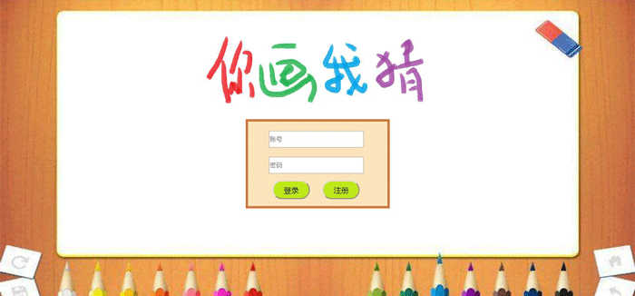

# drawsomething/你画我猜

#### 1 功能
  你画我猜，即随意给出一个词语并指定绘图者，绘图者通过画图表达该词语的意思以便其他用户给出相应答案
#### 2 介绍   
  以Spring+SpringMVC+MyBatis为框架，用WebSocket实现信息实时传输，用canvas实现绘图  
#### 3 截图  
3.1 登录  
    
3.2 绘图  
    
    
    
    
    
3.3 管理  
    

